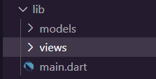
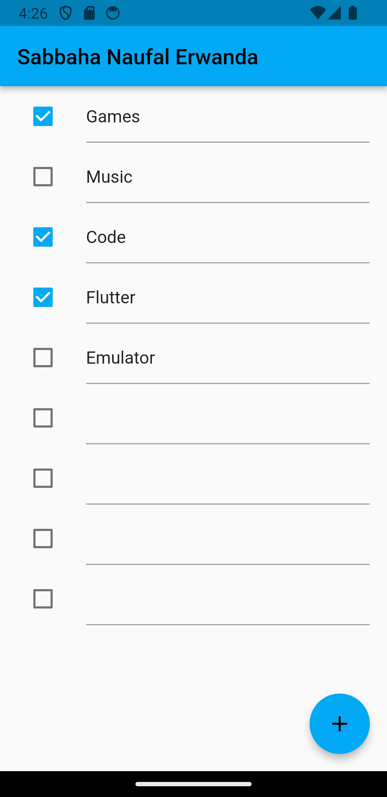

# Praktikum 1: Dasar State dengan Model-View

1. **Buat Project Baru** <br>
   Buatlah sebuah project flutter baru dengan nama **master_plan** di folder `src week-11` repository GitHub Anda. Lalu buatlah susunan folder dalam project seperti gambar berikut ini. <br>
   
   <br><br>

2. **Membuat model task.dart**<br>
   Praktik terbaik untuk memulai adalah pada lapisan data (data layer). Ini akan memberi Anda gambaran yang jelas tentang aplikasi Anda, tanpa masuk ke detail antarmuka pengguna Anda. Di folder model, buat file bernama `task.dart` dan buat `class Task`. Class ini memiliki atribut `description` dengan tipe data String dan `complete` dengan tipe data Boolean, serta ada konstruktor. Kelas ini akan menyimpan data tugas untuk aplikasi kita. Tambahkan kode berikut:

```dart
class Task {
  final String description;
  final bool completed;

  const Task({this.description = '', this.completed = false});
}
```

<br>

3. **Langkah 3: Buat file plan.dart**<br>
   Kita juga perlu sebuah List untuk menyimpan daftar rencana dalam aplikasi to-do ini. Buat file `plan.dart` di dalam folder **models** dan isi kode seperti berikut.

```dart
import './task.dart';

class Plan {
  final String name;
  final List<Task> tasks;

  const Plan({this.name = '', this.tasks = const []});
}
```

<br>

4. **Langkah 4: Buat file data_layer.dart**
   Kita dapat membungkus beberapa data layer ke dalam sebuah file yang nanti akan mengekspor kedua model tersebut. Dengan begitu, proses impor akan lebih ringkas seiring berkembangnya aplikasi. Buat file bernama `data_layer.dart` di folder **models**. Kodenya hanya berisi export seperti berikut.

```dart
export 'plan.dart';
export 'task.dart';
```

<br>

5. **Pindah ke file main.dart**
   Ubah isi kode `main.dart` sebagai berikut.

```dart
import 'package:flutter/material.dart';
import './views/plan_screen.dart';

void main() => runApp(MasterPlanApp());

class MasterPlanApp extends StatelessWidget {
  const MasterPlanApp({super.key});

  @override
  Widget build(BuildContext context) {
    return MaterialApp(
      title: 'Master Plan',
      theme: ThemeData(
        primarySwatch: Colors.lightBlue,
      ),
      home: PlanScreen(),
    );
  }
}
```

<br>

6. **buat plan_screen.dart**<br>
   Pada folder `views`, buatlah sebuah file `plan_screen.dart` dan gunakan templat `StatefulWidget` untuk membuat `class PlanScreen`. Isi kodenya adalah sebagai berikut. Gantilah teks **‘Namaku'** dengan nama panggilan Anda pada `title AppBar`.

```dart
import '../models/data_layer.dart';
import 'package:flutter/material.dart';

class PlanScreen extends StatefulWidget {
  const PlanScreen({super.key});

  @override
  State createState() => _PlanScreenState();
}

class _PlanScreenState extends State<PlanScreen> {
  Plan plan = const Plan();

  @override
  Widget build(BuildContext context) {
    return Scaffold(
      appBar: AppBar(title: const Text('Sabbaha Naufal Erwanda')),
      body: _buildList(),
      floatingActionButton: _buildAddTaskButton(),
    );
  }
}
```

<br>

7. **buat method \_buildAddTaskButton()**<br>
   Anda akan melihat beberapa error di langkah 6, karena method yang belum dibuat. Ayo kita buat mulai dari yang paling mudah yaitu tombol **Tambah Rencana**. Tambah kode berikut di bawah method `build` di dalam `class \_PlanScreenState`.

```dart
Widget _buildAddTaskButton() {
  return FloatingActionButton(
   child: const Icon(Icons.add),
   onPressed: () {
     setState(() {
      plan = Plan(
       name: plan.name,
       tasks: List<Task>.from(plan.tasks)
       ..add(const Task()),
     );
    });
   },
  );
}
```

<br>

8. **buat widget \_buildList()**<br>
   Kita akan buat widget berupa `List` yang dapat dilakukan scroll, yaitu `ListView.builder`. Buat widget `ListView` seperti kode berikut ini.

```dart
Widget _buildList() {
  return ListView.builder(
   itemCount: plan.tasks.length,
   itemBuilder: (context, index) =>
   _buildTaskTile(plan.tasks[index], index),
  );
}
```

<br>

9. **buat widget \_buildTaskTile**<br>
   Dari langkah 8, kita butuh `ListTile` untuk menampilkan setiap nilai dari `plan.tasks`. Kita buat dinamis untuk setiap `index` data, sehingga membuat `view` menjadi lebih mudah. Tambahkan kode berikut ini.

```dart
Widget _buildTaskTile(Task task, int index) {
    return ListTile(
      leading: Checkbox(
          value: task.complete,
          onChanged: (selected) {
            setState(() {
              plan = Plan(
                name: plan.name,
                tasks: List<Task>.from(plan.tasks)
                  ..[index] = Task(
                    description: task.description,
                    complete: selected ?? false,
                  ),
              );
            });
          }),
      title: TextFormField(
        initialValue: task.description,
        onChanged: (text) {
          setState(() {
            plan = Plan(
              name: plan.name,
              tasks: List<Task>.from(plan.tasks)
                ..[index] = Task(
                  description: text,
                  complete: task.complete,
                ),
            );
          });
        },
      ),
    );
  }
```

**Run** atau tekan **F5** untuk melihat hasil aplikasi yang Anda telah buat. Capture hasilnya untuk soal praktikum nomor 4.
<br><br>

10. **Tambah Scroll Controller**<br>
    Anda dapat menambah tugas sebanyak-banyaknya, menandainya jika sudah beres, dan melakukan scroll jika sudah semakin banyak isinya. Namun, ada salah satu fitur tertentu di iOS perlu kita tambahkan. Ketika keyboard tampil, Anda akan kesulitan untuk mengisi yang paling bawah. Untuk mengatasi itu, Anda dapat menggunakan `ScrollController` untuk menghapus focus dari semua `TextField` selama event scroll dilakukan. Pada file `plan_screen.dart`, tambahkan variabel scroll controller di class State tepat setelah variabel `plan`.

```dart
late ScrollController scrollController;
```

Codenya akan berubah menjadi seperti berikut

```dart
class _PlanScreenState extends State<PlanScreen> {
  Plan plan = const Plan();
  late ScrollController scrollController; //Menambahkan variabel scroll controller

  @override
  Widget build(BuildContext context) {
    return Scaffold(
      appBar: AppBar(title: const Text('Sabbaha Naufal Erwanda')),
      body: _buildList(),
      floatingActionButton: _buildAddTaskButton(),
    );
  }
}
```

<br>

11. **Tambah Scroll Listener**<br>
    Tambahkan method `initState()` setelah deklarasi variabel `scrollController` seperti kode berikut.

```dart
@override
void initState() {
  super.initState();
  scrollController = ScrollController()
    ..addListener(() {
      FocusScope.of(context).requestFocus(FocusNode());
    });
}
```

12. **Tambah controller dan keyboard behavior**<br>
    Tambahkan controller dan keyboard behavior pada ListView di method `_buildList` seperti kode berikut ini.

```dart
return ListView.builder(
  controller: scrollController,
 keyboardDismissBehavior: Theme.of(context).platform ==
 TargetPlatform.iOS
          ? ScrollViewKeyboardDismissBehavior.onDrag
          : ScrollViewKeyboardDismissBehavior.manual,
```

<br>

13. **Terakhir, tambah method dispose()**<br>
    Terakhir, tambahkan method `dispose()` berguna ketika widget sudah tidak digunakan lagi.

```dart
@override
void dispose() {
  scrollController.dispose();
  super.dispose();
}
```

<br>

14. **Hasil**<br>
    Lakukan Hot restart (**bukan** hot reload) pada aplikasi Flutter Anda. Anda akan melihat tampilan akhir seperti gambar berikut. Jika masih terdapat error, silakan diperbaiki hingga bisa running.<br>
    
    <br>

## Tugas Praktikum 1: Dasar State dengan Model-View

1.  Jelaskan maksud dari langkah 4 pada praktikum tersebut! Mengapa dilakukan demikian?<br>
    **Jawab**<br>
    - `export plan.dart;`: Ini berarti bahwa file yang sedang berisi kode ini akan mengekspor semua elemen (class, function, variable, dll.) yang didefinisikan dalam file plan.dart. Dengan cara ini, elemen-elemen tersebut dapat diimpor dan digunakan oleh file lain yang mengimpor file ini
    - `export task.dart;`: Begitu juga dengan file `task.dart`, semua elemen yang didefinisikan dalam file tersebut akan diakses oleh file yang mengimpor file ini.
      <br><br>
2.  Mengapa perlu variabel plan di langkah 6 pada praktikum tersebut? Mengapa dibuat konstanta?<br>
    **Jawab**<br>
    Variabel `plan` pada langkah 6 pada praktikum tersebut digunakan untuk menyimpan instance dari kelas `Plan` dari modul `data_layer.dart`. Pada kode tersebut, `Plan` adalah sebuah model atau objek yang mewakili suatu rencana atau data terkait rencana.<br><br>Penggunaan `const Plan()` menunjukkan bahwa kita membuat sebuah instance objek Plan yang bersifat konstan. Pemilihan ini mungkin dilakukan karena data rencana pada saat ini tidak berubah selama masa hidup widget ini. Dengan membuatnya konstan, Flutter dapat melakukan optimasi, dan objek tersebut tidak dapat diubah setelah pembuatannya
    <br><br>
3.  Lakukan capture hasil dari Langkah 9 berupa GIF, kemudian jelaskan apa yang telah Anda buat!
    **Jawab**<br>
    

4.  Apa kegunaan method pada Langkah 11 dan 13 dalam lifecyle state ?
    **Jawab**<br>

    - Methode `initState`:

      - Metode ini dipanggil sekali ketika widget `State` pertama kali dibuat.
      - Digunakan untuk melakukan inisialisasi awal, seperti membuat objek-objek yang diperlukan atau mendaftarkan pendengar perubahan data.
      - Pada contoh di atas, `initState` digunakan untuk membuat ScrollController dan menambahkan pendengar `(addListener)` yang akan meminta fokus dari `FocusScope` ketika `scrollController` mengalami perubahan

    - Methode `dispose`:

           - Metode ini dipanggil ketika widget `State` dihapus dari pohon widget (widget tree).
           - Digunakan untuk membersihkan sumber daya yang digunakan oleh widget atau melakukan tugas bersih-bersih sebelum widget dihapus.
           - Pada contoh di atas, `dispose` digunakan untuk memastikan bahwa `scrollController` dibersihkan dan sumber daya lainnya dilepaskan saat widget dihapus, sehingga menghindari memory leaks atau konsumsi sumber daya yang berlebihan

<br><br>

# Praktikum 2: Mengelola Data Layer dengan InheritedWidget dan InheritedNotifier

1. **Buat file plan_provider.dart**<br>
   Buat folder baru `provider` di dalam folder `lib`, lalu buat file baru dengan nama `plan_provider.dart` berisi kode seperti berikut.

```dart
import 'package:flutter/material.dart';
import '../models/data_layer.dart';

class PlanProvider extends InheritedNotifier<ValueNotifier<Plan>> {
  const PlanProvider({super.key, required Widget child, required
   ValueNotifier<Plan> notifier})
  : super(child: child, notifier: notifier);

  static ValueNotifier<Plan> of(BuildContext context) {
   return context.
    dependOnInheritedWidgetOfExactType<PlanProvider>()!.notifier!;
  }
}
```

<br>

2. **Edit main.dart**<br>
   Gantilah pada bagian atribut `home` dengan `PlanProvider` seperti berikut. Jangan lupa sesuaikan bagian impor jika dibutuhkan.

```dart
return MaterialApp(
  theme: ThemeData(primarySwatch: Colors.purple),
  home: PlanProvider(
    notifier: ValueNotifier<Plan>(const Plan()),
    child: const PlanScreen(),
   ),
);
```

<br>

3. **Tambah method pada model plan.dart**<br>
   Tambahkan dua method di dalam model `class Plan` seperti kode berikut.

```dart
int get completedCount => tasks
  .where((task) => task.complete)
  .length;

String get completenessMessage =>
  '$completedCount out of ${tasks.length} tasks';
```

<br>

4. **Pindah ke PlanScreen**<br>
   Edit `PlanScreen` agar menggunakan data dari `PlanProvider`. Hapus deklarasi variabel `plan` (ini akan membuat error). Kita akan perbaiki pada langkah 5 berikut ini.

<br>

5. **Edit method \_buildAddTaskButton**<br>
   Tambahkan `BuildContext` sebagai parameter dan gunakan `PlanProvider` sebagai sumber datanya. Edit bagian kode seperti berikut.

```dart
Widget _buildAddTaskButton(BuildContext context) {
  ValueNotifier<Plan> planNotifier = PlanProvider.of(context);
  return FloatingActionButton(
    child: const Icon(Icons.add),
    onPressed: () {
      Plan currentPlan = planNotifier.value;
      planNotifier.value = Plan(
        name: currentPlan.name,
        tasks: List<Task>.from(currentPlan.tasks)..add(const Task()),
      );
    },
  );
}
```

<br>

6. **Edit method \_buildTaskTile**<br>
   Tambahkan parameter `BuildContext`, gunakan `PlanProvider` sebagai sumber data. Ganti `TextField` menjadi `TextFormField` untuk membuat inisial `data provider` menjadi lebih mudah.

```dart
Widget _buildTaskTile(Task task, int index, BuildContext context) {
  ValueNotifier<Plan> planNotifier = PlanProvider.of(context);
  return ListTile(
    leading: Checkbox(
       value: task.complete,
       onChanged: (selected) {
         Plan currentPlan = planNotifier.value;
         planNotifier.value = Plan(
           name: currentPlan.name,
           tasks: List<Task>.from(currentPlan.tasks)
             ..[index] = Task(
               description: task.description,
               complete: selected ?? false,
             ),
         );
       }),
    title: TextFormField(
      initialValue: task.description,
      onChanged: (text) {
        Plan currentPlan = planNotifier.value;
        planNotifier.value = Plan(
          name: currentPlan.name,
          tasks: List<Task>.from(currentPlan.tasks)
            ..[index] = Task(
              description: text,
              complete: task.complete,
            ),
        );
      },
    ),
  );
}
```

<br>

7. **Edit \_buildList**<br>
   Sesuaikan parameter pada bagian `\_buildTaskTile` seperti kode berikut.

```dart
Widget _buildList(Plan plan) {
   return ListView.builder(
     controller: scrollController,
     itemCount: plan.tasks.length,
     itemBuilder: (context, index) =>
        _buildTaskTile(plan.tasks[index], index, context),
   );
}
```

<br>

8. **Tetap di class PlanScreen**<br>
   Edit method build sehingga bisa tampil progress pada bagian bawah (footer). Caranya, bungkus (wrap) \_buildList dengan widget Expanded dan masukkan ke dalam widget Column seperti kode pada Langkah 9.
   <br>

9. **Tambah widget SafeArea**<br>
   Terakhir, tambahkan widget SafeArea dengan berisi completenessMessage pada akhir widget Column. Perhatikan kode berikut ini.

```dart
@override
Widget build(BuildContext context) {
   return Scaffold(
     appBar: AppBar(title: const Text('Sabbaha Naufal Erwanda')),
     body: ValueListenableBuilder<Plan>(
       valueListenable: PlanProvider.of(context),
       builder: (context, plan, child) {
         return Column(
           children: [
             Expanded(child: _buildList(plan)),
             SafeArea(child: Text(plan.completenessMessage))
           ],
         );
       },
     ),
     floatingActionButton: _buildAddTaskButton(context),
   );
}
```

Akhirnya, **run** atau tekan **F5** jika aplikasi belum running. Tidak akan terlihat perubahan pada UI, namun dengan melakukan langkah-langkah di atas, Anda telah menerapkan cara memisahkan dengan baik antara **view** dan **model**. Ini merupakan hal terpenting dalam mengelola **state** di aplikasi Anda.
