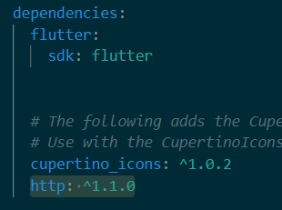
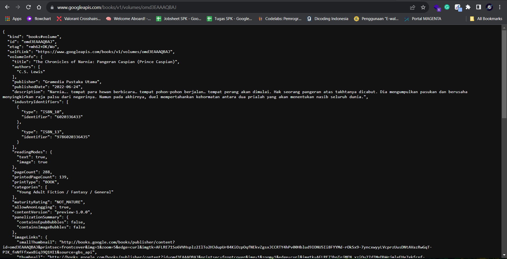

# Praktikum 1: Mengunduh Data dari Web Service (API)

1. Buat Project Baru<br>
   Buatlah sebuah project flutter baru dengan nama **books** di folder **src week-12** repository GitHub Anda. Kemudian Tambahkan dependensi `http` dengan mengetik perintah berikut di terminal.

```flutter
   flutter pub add http
```

2. Cek file pubspec.yaml<br>
   Jika berhasil install plugin, pastikan plugin `http` telah ada di file `pubspec` ini seperti berikut.
   

3. Buka file main.dart<br>
   Ketiklah kode seperti berikut ini.

**Soal 1**<br>
Tambahkan nama panggilan Anda pada `title app` sebagai identitas hasil pekerjaan Anda.

```dart
import 'dart:async';
import 'package:flutter/material.dart';
import 'package:http/http.dart';
import 'package:http/http.dart' as http;

void main() {
  runApp(const MyApp());
}

class MyApp extends StatelessWidget {
  const MyApp({Key? key}) : super(key: key);

  @override
  Widget build(BuildContext context) {
    return MaterialApp(
      title: 'Future demo Baha', #menambahkan nama pada title
      theme: ThemeData(
          primarySwatch: Colors.blue,
          visualDensity: VisualDensity.adaptivePlatformDensity),
      home: const FuturePage(),
    );
  }
}

class FuturePage extends StatefulWidget {
  const FuturePage({Key? key}) : super(key: key);

  @override
  State<FuturePage> createState() => _FuturePageState();
}

class _FuturePageState extends State<FuturePage> {

  String result = '';
  @override
  Widget build(BuildContext context) {
    return Scaffold(
      appBar: AppBar(
        title: const Text('Back from Future Demo'),
      ),
      body: Center(
        child: Column(children: [
          const Spacer(),
          ElevatedButton(
            child: const Text('GO!'),
            onPressed: () {},
          ),
          const Spacer(),
          Text(result),
          const Spacer(),
          const CircularProgressIndicator(),
          const Spacer(),
        ]),
      ),
    );
  }
}

```

4. Tambah method getData()<br>
   Tambahkan method ini ke dalam `class_FuturePageState` yang berguna untuk mengambil data dari API Google Books.

```dart
Future<Response> getData() async {
    const authority = 'www.googleapis.com';
    const Path = '/books/v1/volumes/omd3EAAAQBAJ';
    Uri url = Uri.https(authority, Path);
    return http.get(url);
}
```

**Soal 2**

- Carilah judul buku favorit Anda di Google Books, lalu ganti ID buku pada variabel path di kode tersebut
  
- Kemudian cobalah akses di browser URI tersebut dengan lengkap seperti ini. Jika menampilkan data JSON, maka Anda telah berhasil.
  
