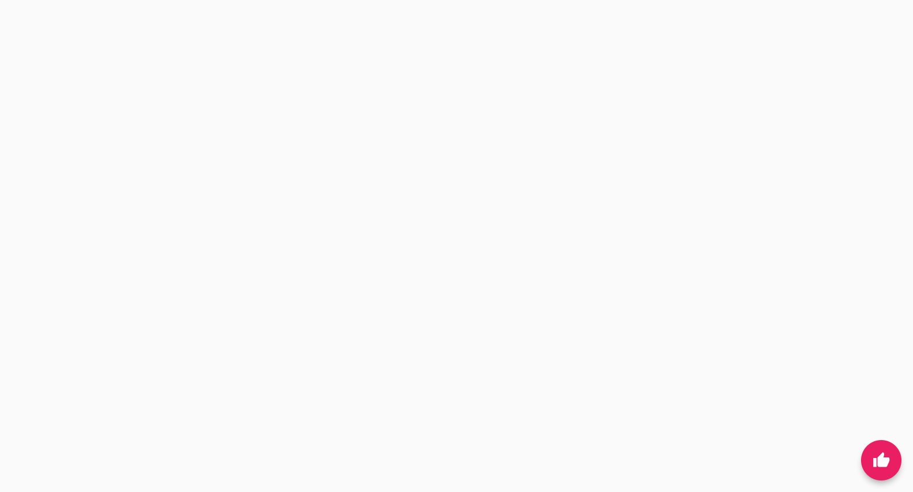

# Flutter Fundamental

Praktikum Sabbaha Naufal Erwanda

## Praktikum 3: Menerapkan Widget Dasar

### Langkah 1: Text Widget

- Membuat folder baru dengan nama `basic_widget` didalam folder lib dan membuat file dengan nama `text_widget.dart`

- Menambahkan baris code seperti berikut

- Import ke `main.dart`

- Jalankan aplikasi dan lihat hasilnya

### Langkah 2: Image Widget

- Membuat file dengan nama `image_widget.dart`

- Menambahkan baris code seperti berikut

- Membuat folder baru bernama `assets` untuk menyimpan file gambar yang akan ditampilkan

- Mengedit code line di `pubspec.yaml`

- Import ke `main.dart`

- Jalankan aplikasi dan lihat hasilnya

di bagian bawah foto terdapat garis hitam kuning yang menandakan foto melebihi batas yang ditampilkan

- Agar tidak foto melebihi batas, pada `image_widget.dart` ditambahkan code sebagai berikut

- Jalankan aplikasi dan lihat hasilnya

## Praktikum 4: Menerapkan Widget Material Design dan iOS Cupertino

### Langkah 1: Cupertino Button dan Loading Bar

- Membuat file di folder `basic_widgets` dengan nama `loading_cupertino.dart`

- Import pada file `main.dart`

- Jalankan aplikasi dan lihat hasilnya

### Langkah 2: Floating Action Button (FAB)

- Membuat file di folder `basic_widgets` dengan nama `fab_widget.dart`

- Import pada file `main.dart`

- Jalankan aplikasi dan lihat hasilnya

## Langkah 3: Scaffold Widget

- Buat file baru dalam folder `basic_widgets` bernama `scafold.dart`

- Menambahkan baris code di file `main.dart` pada `class _MyHomePageState`

- Jalankan aplikasi dan lihat hasilnya

## Langkah 4: Dialog Widget

- Buat file baru dalam folder `basic_widgets` bernama `dialog.dart`

- Menambahkan baris code di file `main.dart` pada `class _MyHomePageState`

- Jalankan aplikasi dan lihat hasilnya

## Langkah 5: Input dan Selection Widget

- Buat file baru dalam folder `basic_widgets` bernama `inputSelect.dart`

- Menambahkan baris code di file `main.dart` pada `class _MyHomePageState`

- Jalankan aplikasi dan lihat hasilnya

## Langkah 6: Date and Time Pickers

- Buat file baru dalam folder `basic_widgets` bernama `picker.dart`

- Menambahkan baris code di file `main.dart` pada `class _MyHomePageState`

- Jalankan aplikasi dan lihat hasilnya

