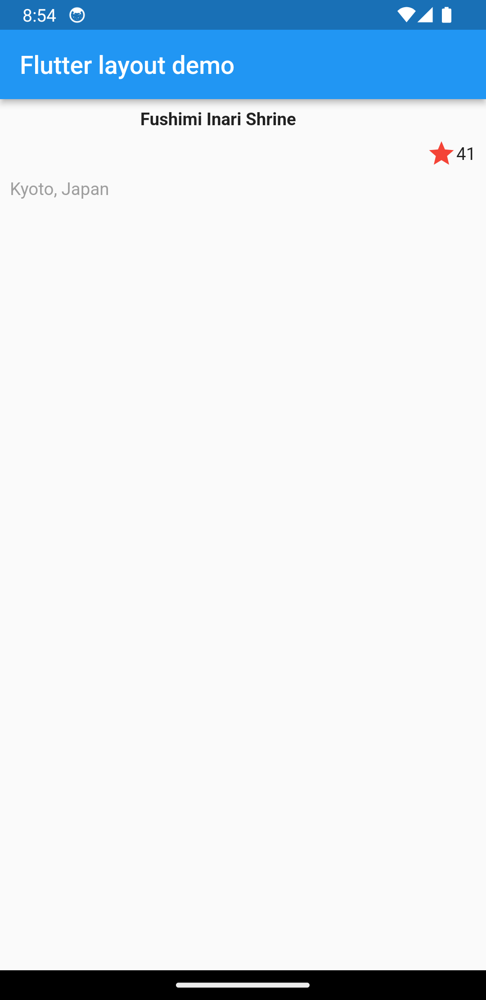
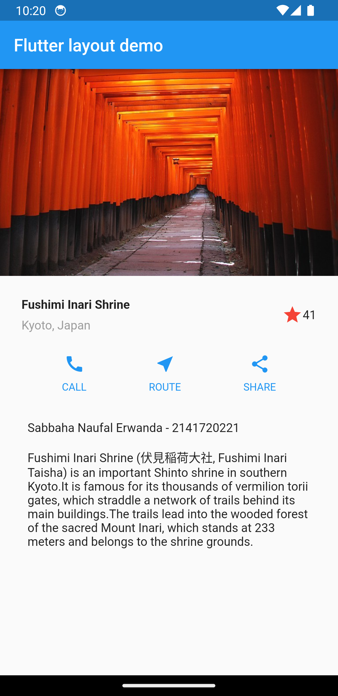

# layout_dan_navigasi

Nama : Sabbaha Naufal Erwanda

Kelas : TI-3A

NIM : 2141720221

# Praktikum 1: Buat Project Baru

## Langkah 2: Buka file lib/main.dart

Buka file `main.dart` lalu ganti dengan kode berikut. Isi nama dan NIM Anda di `text title`

<!--  -->

## Langkah 3: Identifikasi layout diagram

Langkah pertama adalah memecah tata letak menjadi elemen dasarnya:

- Identifikasi baris dan kolom.
- Apakah tata letaknya menyertakan kisi-kisi (grid)?
- Apakah ada elemen yang tumpang tindih?
- Apakah UI memerlukan tab?
- Perhatikan area yang memerlukan alignment, padding, atau borders.

## Langkah 4: Implementasi title row

Pertama, Anda akan membuat kolom bagian kiri pada judul. Tambahkan kode berikut di bagian atas metode `build()` di dalam kelas `MyApp`:

- Soal 1
  Letakkan widget `Column` di dalam widget `Expanded` agar menyesuaikan ruang yang tersisa di dalam widget `Row`. Tambahkan properti `crossAxisAlignment` ke `CrossAxisAlignment.start` sehingga posisi kolom berada di awal baris.

- Soal 2
  Letakkan baris pertama teks di dalam `Container` sehingga memungkinkan Anda untuk menambahkan padding = 8. Teks ‘`Kyoto, Japan`' di dalam `Column`, set warna menjadi abu-abu.

- Soal 3
  Dua item terakhir di baris judul adalah ikon bintang, set dengan warna merah, dan teks "41". Seluruh baris ada di dalam `Container` dan beri padding di sepanjang setiap tepinya sebesar 32 piksel. Kemudian ganti isi `body text ‘Hello World'` dengan variabel `titleSection` seperti berikut:
  

### jawab:

- dengan sintaks sebagai berikut:

  

- Output:

  

# Praktikum 2: Implementasi button row

## Langkah 1: Buat method Column \_buildButtonColumn

## Langkah 2: Buat widget buttonSection

## Langkah 3: Tambah button section ke body

Tambahkan variabel `buttonSection` ke dalam `body` seperti berikut:

# Praktikum 3: Implementasi text section

## Langkah 1: Buat widget textSection

Tentukan bagian teks sebagai variabel. Masukkan teks ke dalam `Container` dan tambahkan padding di sepanjang setiap tepinya. Tambahkan kode berikut tepat di bawah deklarasi `buttonSection`:

## Langkah 2: Tambahkan variabel text section ke body

Tambahkan widget variabel `textSection` ke dalam `body`:

# Praktikum 4: Implementasi image section

## Langkah 1: Siapkan aset gambar

Menambahkan assets di `pubspec.yaml`

## Langkah 2: Tambahkan gambar ke body

Tambahkan aset gambar ke dalam `body`

## Langkah 3: Terakhir, ubah menjadi ListView

atur semua elemen dalam `ListView`, bukan Column, karena `ListView` mendukung scroll yang dinamis saat aplikasi dijalankan pada perangkat yang resolusinya lebih kecil

# Tampilan Akhir:

