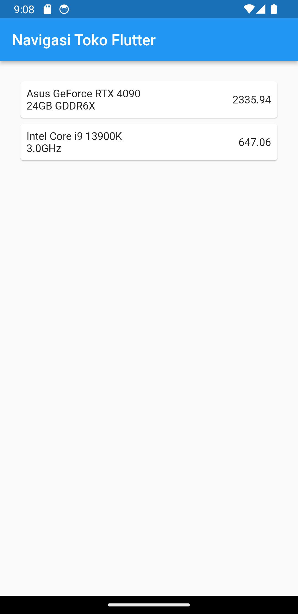
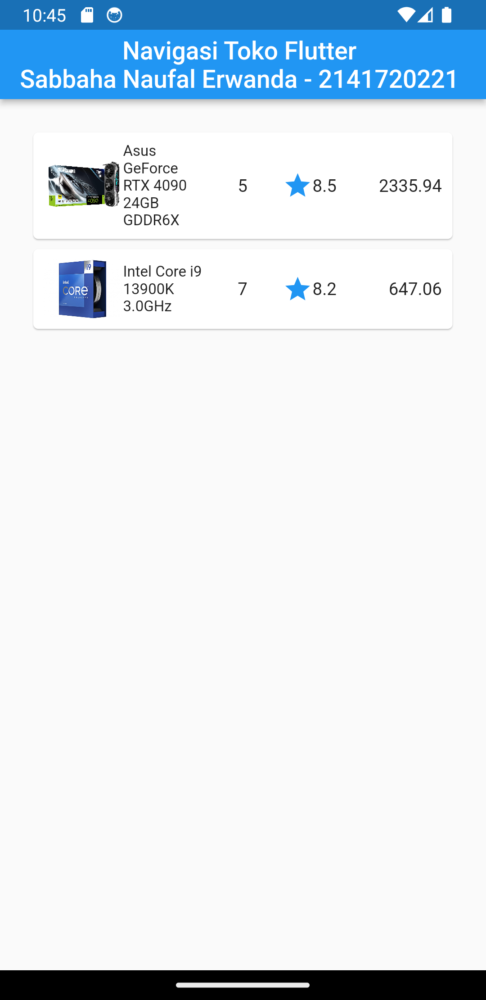
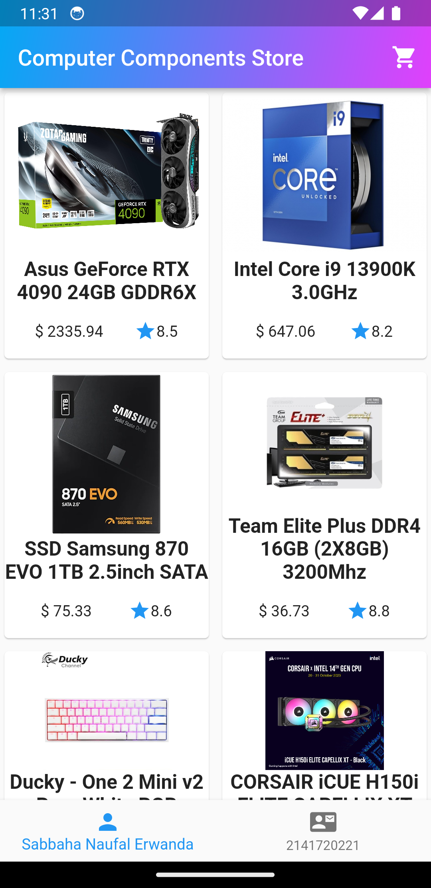

# belanja - Sabbaha Naufal Erwanda

**Link repositori: https://github.com/Maisho20/Pemrograman-Mobile/tree/main/Week%208/belanja**

## Langkah 1: Siapkan project baru

> Sebelum melanjutkan praktikum, buatlah sebuah project baru Flutter dengan nama belanja dan susunan folder seperti pada gambar berikut. Penyusunan ini dimaksudkan untuk mengorganisasi kode dan widget yang lebih mudah.

## Langkah 2: Mendefinisikan Route

> Buatlah dua buah file dart dengan nama `home_page.dart` dan `item_page.dart` pada folder pages. Untuk masing-masing file, deklarasikan `class HomePage` pada file `home_page.dart` dan ItemPage pada `item_page.dart`. Turunkan class dari `StatelessWidget`.

## Langkah 3: Lengkapi Kode di main.dart

Setelah kedua halaman telah dibuat dan didefinisikan, bukalah file `main.dart`. Pada langkah ini anda akan mendefinisikan Route untuk kedua halaman tersebut. Definisi penamaan route harus bersifat unique. Halaman HomePage didefinisikan sebagai /. Dan halaman ItemPage didefinisikan sebagai /item. Untuk mendefinisikan halaman awal, anda dapat menggunakan `named argument initialRoute`.

## Langkah 4: Membuat data model

Sebelum melakukan perpindahan halaman dari `HomePage` ke `ItemPage`, dibutuhkan proses pemodelan data. Pada desain mockup, dibutuhkan dua informasi yaitu nama dan harga. Untuk menangani hal ini, buatlah sebuah file dengan nama `item.dart` dan letakkan pada folder models.

## Langkah 5: Lengkapi kode di class HomePage

Pada halaman `HomePage` terdapat `ListView` widget. Sumber data `ListView` diambil dari model List dari object Item.

## Langkah 6: Membuat ListView dan itemBuilder

Untuk menampilkan `ListView` pada praktikum ini digunakan `itemBuilder`. Data diambil dari definisi model yang telah dibuat sebelumnya. Untuk menunjukkan batas data satu dan berikutnya digunakan widget `Card`.

## Langkah 7: Menambahkan aksi pada ListView

Item pada ListView saat ini ketika ditekan masih belum memberikan aksi tertentu. Untuk menambahkan aksi pada ListView dapat digunakan widget `InkWell` atau `GestureDetector`. Perbedaan utamanya `InkWell` merupakan material widget yang memberikan efek ketika ditekan. Sedangkan `GestureDetector` bersifat umum dan bisa juga digunakan untuk gesture lain selain sentuhan. Pada praktikum ini akan digunakan widget `InkWell`

Hasil outputnya:

# TUGAS

## Menambahkan atribut foto produk, stok, dan rating

Hasil Output:

# Modifikasi Grid View

