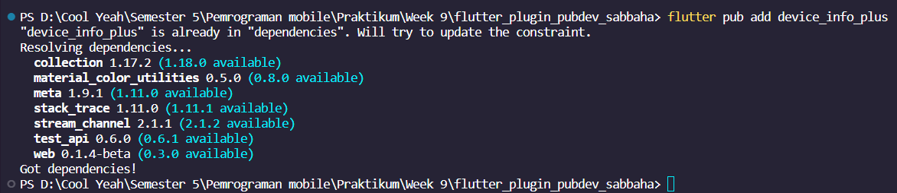
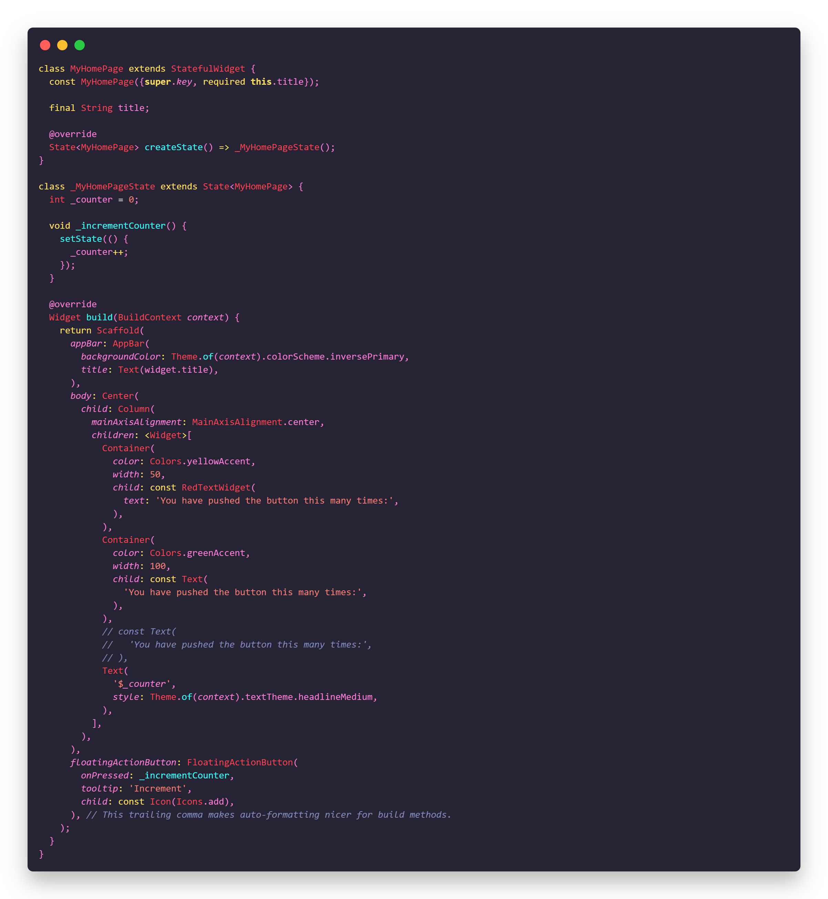
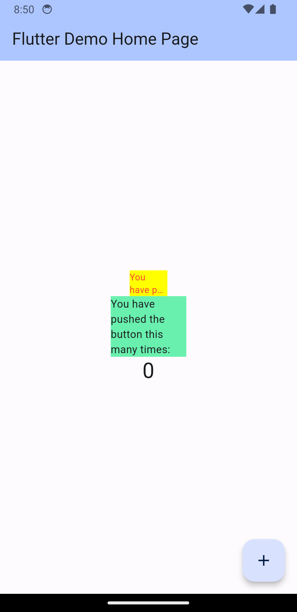

# flutter_plugin_pubdev_sabbaha

**Nama: Sabbaha Naufal Erwanda**

**Kelas: 2A**

**NIM: 2141720221**

**Tugas: Membuat plugin pub.dev untuk menampilkan data dari API**

**[Link Repositories](https://github.com/Maisho20/Pemrograman-Mobile/tree/main/Week%209/flutter_plugin_pubdev_sabbaha)**

# Persiapan praktikum

**Menambahkan plugin `auto_size_text`**
dengan menjalankan `Command` berikut, untuk menambahkan plugin kedalam project flutter


Hasil running `Command`


Maka, di `pubspec.yaml` akan otomatis menambahkan pugin yang di jalankan di `Command`


**Menambahkan plugin device_info_plus**




**Menambahkan `dependency_overrides` pada `pubspec.yaml`**

```dart
dependency_overrides:
  device_calendar:
    git:
      url: https://github.com/thomassth/device_calendar_null.git
```

# Praktikum Menerapkan Plugin di Project Flutter

**Langkah 3: Buat file red_text_widget.dart**
Buat file baru bernama `red_text_widget.dart` di dalam folder lib.


**Langkah 4: Tambah Widget AutoSizeText**
di file `red_text_widget.dart`, untuk menggunakan plugin `auto_size_text`, ubahlah kode `return Container()`

```dart
Widget build(BuildContext context) {
    // return Container();
    return AutoSizeText(
      text, // akan terjadi error di sebelah sini
      style: const TextStyle(color: Colors.red, fontSize: 14),
      maxLines: 2,
      overflow: TextOverflow.ellipsis,
    );
  }
```

Error tersebut terjadi karena `"Undefined name 'text'"` yang berarti variabel text tidak terdefinisi dalam cakupan saat ini. Dalam kode diatas, teks digunakan sebagai parameter untuk AutoSizeText namun tidak didefinisikan di mana pun dalam metode build atau dalam kelas yang berisi metode ini.

Untuk mengatasi error tersebut, perlu memastikan bahwa teks didefinisikan sebelum digunakan. Ini bisa berupa properti dari kelas yang berisi metode build, atau bisa juga berupa parameter dari metode build itu sendiri.

```dart
import 'package:flutter/material.dart';
import 'package:auto_size_text/auto_size_text.dart';

class RedTextWidget extends StatelessWidget {
  final String text;
  const RedTextWidget({super.key, required this.text}); //Menambahkan property text

  // const RedTextWidget({Key? key}) : super(key: key);

  @override
  Widget build(BuildContext context) {
    // return Container();
    return AutoSizeText(
      text,
      style: const TextStyle(color: Colors.red, fontSize: 14),
      maxLines: 2,
      overflow: TextOverflow.ellipsis,
    );
  }
}
```

**Langkah 5: Buat Variabel text dan parameter di constructor**
Tambahkan variabel `text` dan parameter di constructor

```dart
final String text;

const RedTextWidget({Key? key, required this.text}) : super(key: key);
```

**Langkah 6: Tambahkan widget di main.dart**
Buka file `main.dart` lalu tambahkan di dalam `children:` pada `class _MyHomePageState`


**Hasil:**



# Tugas Praktikum

1.  Selesaikan Praktikum tersebut, lalu dokumentasikan dan push ke repository Anda berupa screenshot hasil pekerjaan beserta penjelasannya di file `README.md`!
    <br><br>
2.  Jelaskan maksud dari langkah 2 pada praktikum tersebut!
    <br><br>
    **Penjelasan**

    Perintah `flutter pub add auto_size_text` digunakan untuk secara otomatis menambahkan paket Flutter bernama `"auto_size_text"` ke proyek Anda. Ini memperbarui berkas proyek Anda, mengunduh dan menginstal paket tersebut, dan memungkinkan Anda untuk menggunakan fungsionalitas dari paket `"auto_size_text"` dalam proyek Flutter Anda tanpa harus mengelola dependensi secara manual.
    <br><br>

3.  Jelaskan maksud dari langkah 5 pada praktikum tersebut!
    <br><br>
    **Penjelasan**

    Terjadi error pada langkah 4 praktikum pada `return AutoSizeText()` karena atribut `text` tidak dikenali. Untuk mengatasi error tersebut, anda harus menambahkan code line

    ```dart
    final String text;
    const RedTextWidget({super.key, required this.text});
    ```

    Langkah ini menyatakan bahwa kita membuat sebuah class dengan nama `RedTextWidget`, yang memiliki dua properti `key` dan `text`. Properti `key` digunakan untuk mengidentifikasi widget tersebut secara unique, sedangkan `text` adalah teks yang aakan disimpan oleh widget tersebut. Kedua-duanya harus diisi saat konstruktor objek tercipta.
    <br><br>

4.  Pada langkah 6 terdapat dua widget yang ditambahkan, jelaskan fungsi dan perbedaannya!
    <br><br>
    **Penjelasan**

    Pada langkah 6 menambahkan code line seperti berikut

    ```dart
    Container(
     color: Colors.yellowAccent,
     width: 50,
     child: const RedTextWidget(
         text: 'You have pushed the button this many times:',
         ),
     ),
    Container(
     color: Colors.greenAccent,
     width: 100,
     child: const Text(
            'You have pushed the button this many times:',
           ),
    ),
    ```

    Dalam kode di atas, `RedTextWidget` adalah widget yang memiliki parameter `text`. Sedangkan `Container` adalah widget yang membuat container dengan warna hijau. Kedua-dua ini digunakan untuk menghasilkan output yang sama namun dengan cara yang beda.

    - `const RedTextWidget`: Widget ini tidak bisa diubah setelah program dijalankan. Artinya, jika kita ingin mengganti teks "You have pushed the button this many times:" dengan teks lain, kita harus menghapus widget ini dan buat baru.
    - `Text`: Widget ini bisa diubah setelah program dijalankan. Artinya, kita bisa mengganti teksnya tanpa perlu menghapus widget ini.
      <br><br>

5.  Jelaskan maksud dari tiap parameter yang ada di dalam plugin auto_size_text berdasarkan tautan pada dokumentasi [ini](https://pub.dev/documentation/auto_size_text/latest/)
    <br><br>
    **Penjelasan**

    1. **text** (`String`):

    - Parameter ini adalah teks yang akan ditampilkan oleh `AutoSizeText`. Ini adalah teks yang akan disesuaikan ukurannya sesuai dengan ruang yang tersedia.

    2.  **style** (`TextStyle`):

    - Parameter ini digunakan untuk mengatur gaya teks seperti warna, ukuran font, tebal, dan sebagainya. Dalam contoh yang Anda berikan, warna teks diatur menjadi merah dengan ukuran font 14.

    3.  **maxLines** (`int`):

    - Parameter ini digunakan untuk membatasi jumlah baris maksimal yang akan ditampilkan oleh `AutoSizeText`. Jika teks melebihi jumlah baris yang ditentukan, teks akan dipotong dengan "..." (elipsis).

    4.  **overflow** (`TextOverflow`):

    - Parameter ini digunakan untuk menentukan bagaimana teks yang melebihi jumlah baris maksimal (`maxLines`) akan ditampilkan. `TextOverflow.ellipsis` digunakan dalam contoh Anda, yang berarti teks yang melewati batas akan ditampilkan dengan elipsis ("...").

    <br>

6.  Kumpulkan laporan praktikum Anda berupa link repository GitHub ke spreadsheet yang telah disediakan!
